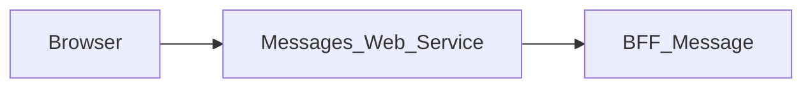

# Messages_Web_Service — Technical documentation

## Timestamp presentation — MAIR-303

`src/lib/message-timestamps.ts` adapts only `sentAt` and `lastMessageAt` to
French display labels in the browser timezone before rendering `Messaging`.
Presentation arrays are derived with `useMemo`; raw BFF state, ordering,
identifiers, content and network payloads stay intact. Only valid ISO date-time
values are converted; date-only and unknown labels remain unchanged. Valid
standalone legacy times such as `9 h 05` become `9:05`. There is no current-time
or demo-data fallback. Responses arrive after client mount, so the server's
timezone does not determine their browser display. Coverage includes
`message-timestamps.test.cjs` (UTC, Réunion and Paris daylight-saving changes)
and page loading/selection/refresh/send scenarios. No contract, dependency or
environment change is required.

## Active-module menu — MAIR-180 preparatory slice

Only the Sidebar item list excludes `emails` and `files`; existing URL resolution,
environment configuration, sessions and BFF calls are unchanged. Both desktop and
mobile render the same active list. Page-level regression coverage renders the
real Sidebar, checks item order/active item/admin visibility, opens the mobile
menu and follows Settings while closing the drawer. No library fork or new
package is introduced; the full MAIR-179/MAIR-180 AppShell dependency remains.

## Settings account destination — MAIR-180 slice

The server route `/profile/[[...path]]` replaces the local profile screens.
It temporarily redirects (307) to `SETTINGS_FRONT_URL`, resolved on each request;
no business profile is fetched by this module. Missing, invalid, credential-bearing
or legacy `profile` path destinations render an unavailable state with a link
back to the module. Old bookmark query parameters are not forwarded. Middleware
authentication is unchanged. No new contract, package, secret or environment
variable is introduced. This slice does not complete shared AppShell migration
(MAIR-179).

## Explicit frontend destinations (MAIR-177)

Frontend redirects use only explicitly configured HTTP(S) URLs without embedded
credentials. There is no implicit localhost destination. Set the existing
`LOGIN_FRONT_URL` (protected fronts) and `PROJECT_FRONT_URL` (Login default)
at runtime, including local development. A valid configured return destination
may still be used by Login when its default is absent. Invalid or missing
Login destinations produce an uncached HTTP 503 message in the middleware;
Login itself displays an unavailable state without a form when no destination
can be resolved. No BFF/API contract or deployment variable is added.


[Module overview](module.md) · [Français](../fr/technical.md) · [README](../../README.md)

## Architecture and request handling

Next.js 15.5.25, React 19 and TypeScript application using the App Router. The browser calls same-origin routes; the Next.js server forwards data to **BFF_Message**.



The page uses the messaging client to load bootstrap, then messages and contacts on demand. It maps responses for the shared `Messaging` component. After bootstrap, it fetches `/conversations` and the active thread every ten seconds while the tab is visible, and when focus resumes. Responses arriving after a selection or mutation are ignored so they cannot overwrite newer state; a sync failure preserves the last known thread and shows an alert. The explicit `/business-references` route forwards the BFF Message response.

Business suggestions load independently through `messageClient.getBusinessReferences()` on mount and on focus/visibility changes while the page is visible. A per-effect in-flight guard coalesces simultaneous events; no additional polling interval is created. Successful responses replace the list, including an empty list. Transient failures keep the last successful suggestions, while HTTP 401/403 clears them. Unmount removes both listeners and ignores pending responses. `tests/messages-page.contract-mocks.test.cjs` covers this lifecycle through the real frontend client and proxy with contract-driven mocks; this does not add persistence for sent references, attachments or read acknowledgements.

The generic proxy reads the versioned OpenAPI contract to allow paths and methods. It preserves query parameters, binary bodies, statuses and useful headers, filters transport headers, disables caching and does not automatically follow redirects. Its timeout is 15 seconds.

## Data and persistence

The following sources and limitations describe the associated BFF, which determines persistence for the displayed data.

Conversations and messages use Message API. Contacts are read directly from the SQL `users` table, including the current user (token `sub` identifier). Business references are aggregated from BFF Project and BFF Calendar. Local profile edits, attachment metadata and the read acknowledgement do not provide complete persistence.

Attachment upload currently creates metadata and does not provide durable binary storage. Mark-as-read returns a zero counter without writing to Message API; the page therefore does not call that route or locally clear unread counts. Conversation groups use the API, while some profile data remains local to the process.

React state manages display and pending operations. This repository defines no business database of its own; save guarantees come from the BFF and its sources described above.

## Installation and local startup

Use Node.js 22 to reproduce the contract job and npm with the committed lockfile. Other job and Docker versions are detailed below.

Private `@mairie360/*` dependencies require GitHub Packages access. Set `NODE_AUTH_TOKEN` in the environment to a token allowed to read these packages, as configured in `.npmrc`. Do not commit its value.

```bash
npm ci
```

Create `.env.local` in the repository root. Example for BFFs running on the same machine:

```dotenv
BFF_MESSAGE_BASE_URL=http://localhost:4003
```

Start BFF Message, the front's only BFF, then start the web service. Port `5003` below is an explicit local choice to avoid collisions; it is not a claim about ports in every Compose file.

```bash
npm run dev
```

Open `http://localhost:5003`. To run the build with the Next.js script:

```bash
npm run build
npm run start -- --port 5003
```

## Configuration

On a missing or expired session, the middleware sends `redirect` to Login. It builds the destination from the runtime `MESSAGE_FRONT_URL` plus the requested path and query, never from the internal ingress host. Without a valid public URL, Login uses its default Projects destination.

Values below are local examples or explicitly described behavior, not production credentials.

| Variable or precedence | Example / stated fallback | Purpose |
| --- | --- | --- |
| `BFF_MESSAGE_BASE_URL` → `MESSAGE_BFF_URL` → `NEXT_PUBLIC_BFF_MESSAGE_BASE_URL` | http://localhost:4003 | Left-to-right proxy precedence; configure an HTTP(S) URL explicitly. Missing or invalid configuration returns an uncached 503 without contacting an upstream. |
| `COOKIE_DOMAIN` | — | Domain of the `accessToken` cookie, set by Login and cleared by the local logout; keep it consistent with Login. |
| `ADMINISTRATION_FRONT_URL` | — | Navigation destination; see the source file that reads it. Variables injected by `next.config.ts` or prefixed `NEXT_PUBLIC_` are public and consumed at build time. |
| `CALENDAR_FRONT_URL` | — | Navigation destination; see the source file that reads it. Variables injected by `next.config.ts` or prefixed `NEXT_PUBLIC_` are public and consumed at build time. |
| `ELEARNING_FRONT_URL` | — | Navigation destination; see the source file that reads it. Variables injected by `next.config.ts` or prefixed `NEXT_PUBLIC_` are public and consumed at build time. |
| `EMAIL_FRONT_URL` | — | Navigation destination; see the source file that reads it. Variables injected by `next.config.ts` or prefixed `NEXT_PUBLIC_` are public and consumed at build time. |
| `FILES_FRONT_URL` | — | Navigation destination; see the source file that reads it. Variables injected by `next.config.ts` or prefixed `NEXT_PUBLIC_` are public and consumed at build time. |
| `LOGIN_FRONT_URL` | — | Navigation destination; see the source file that reads it. Variables injected by `next.config.ts` or prefixed `NEXT_PUBLIC_` are public and consumed at build time. |
| `MESSAGE_FRONT_URL` | — | Navigation destination; see the source file that reads it. Variables injected by `next.config.ts` or prefixed `NEXT_PUBLIC_` are public and consumed at build time. |
| `PROJECT_FRONT_URL` | — | Navigation destination; see the source file that reads it. Variables injected by `next.config.ts` or prefixed `NEXT_PUBLIC_` are public and consumed at build time. |

Inside a container, `localhost` refers to that container. Use the BFF service DNS name on the Docker network or a reachable host address. `docker-compose.yml` starts the database, Message API, BFF Message and this front in `next dev` mode on port 5003. The security and performance stacks start the same chain from published images. BFF Message is the only BFF there, in the contract package version.

## Routes and data contract

Inventory extracted from `contracts/openapi.json`. Replace brace parameters with real identifiers. Detailed types, required fields, responses and any examples are defined in that contract; table statuses are the declared statuses, not an exhaustive list of transport or validation errors.

These data paths are exposed at the same origin through the proxy; Next.js pages are separate. `/openapi.json` and `/swagger.json` are also forwarded. Open the `/docs` Swagger UI directly on the BFF.

| Method | Path | Declared body | Declared statuses |
| --- | --- | --- | --- |
| POST | `/attachments` | multipart/form-data | 401, 2XX |
| GET | `/business-references` | — | 2XX |
| GET | `/check_apis` | — | 2XX |
| GET | `/contacts` | — | 401, 2XX |
| GET | `/conversations` | — | 401, 2XX |
| DELETE | `/conversations/{conversationId}` | — | 2XX |
| GET | `/conversations/{conversationId}/messages` | — | 401, 2XX |
| POST | `/conversations/{conversationId}/messages` | application/json | 401, 2XX |
| POST | `/conversations/{conversationId}/read` | application/json | 2XX |
| POST | `/direct-messages` | application/json | 401, 2XX |
| POST | `/groups` | application/json | 401, 2XX |
| GET | `/health` | — | 2XX |
| GET | `/me` | — | 401, 2XX |
| PATCH | `/me` | application/json | 400, 2XX |
| GET | `/messaging/bootstrap` | — | 401, 2XX |

### Pages and local adapters

| Page | Source |
| --- | --- |
| `/` | [src/app/page.tsx](../../src/app/page.tsx) |
| `/profile/[[...path]]` | [src/app/profile/[[...path]]/page.tsx](../../src/app/profile/%5B%5B...path%5D%5D/page.tsx) |

| Method | Local route | Source |
| --- | --- | --- |
| GET | `/business-references` | [src/app/business-references/route.ts](../../src/app/business-references/route.ts) |
| POST | `/api/auth/logout` | [src/app/api/auth/logout/route.ts](../../src/app/api/auth/logout/route.ts) |

## Session, permissions and errors

BFF Message is the front's only BFF: the session shown by the shell comes from `GET /me`, relayed by the proxy. `/api/auth/logout` is a local route that clears the `accessToken` cookie (same name, path and `COOKIE_DOMAIN` as Login) with no network call; the reload that follows is redirected to Login by the middleware. The JWT is not revoked server-side, exactly as with BFF User's logout, which also only cleared the cookie. The generic proxy uses an explicit Bearer header or, when absent, the `accessToken` cookie. Business permissions remain those of the BFF and its sources.

The generic proxy returns 400 for an invalid path, 404 for a path outside the contract, 405 for a disallowed method and 502 when the service is unreachable or times out. Upstream responses are preserved, including empty 204/205/304 bodies.

Every response carries `X-Frame-Options: DENY`, `X-Content-Type-Options: nosniff`, `Referrer-Policy`, `Permissions-Policy` and `Cross-Origin-Resource-Policy`, `Cross-Origin-Embedder-Policy` and `Cross-Origin-Opener-Policy` (`next.config.ts`), and `X-Powered-By` is disabled. For authenticated requests, [src/middleware.ts](../../src/middleware.ts) adds a `Content-Security-Policy` with a per-request nonce, which Next.js applies to its scripts. Pages are therefore rendered on demand (`dynamic = "force-dynamic"` in the layout). Stylesheets are limited to the origin and the nonce; only `style` attributes rendered by components are allowed through `style-src-attr 'unsafe-inline'`, and `next dev` also allows `'unsafe-eval'`. Any new external resource (image, font, API called from the browser) must be added to the policy in `src/lib/content-security-policy.ts`.

## Synchronization and verification

The contract source is the published `@mairie360/bff-message-openapi` package, pinned to an exact version in `package.json`. Never copy the contract from a **BFF_Message** checkout: the local repository can be ahead of the last published release. After a version bump:

```bash
npm install --save-exact @mairie360/bff-message-openapi@X.Y.Z   # published releases only, never 0.0.0-dev/staging
npm run contracts:sync      # rebuild contracts/openapi.json from the installed package
npm run contracts:check     # fail if the version isn't exact, if a second bff-*-openapi package exists, or if the snapshot is stale
npm test
npm run lint
npm run build
```

These commands run offline. Move the `bff-message` image tags in the `docker-compose*.yml` files to the same version as well (`tests/package-contract.test.cjs` enforces it). `contracts/openapi.json` is the committed rebuild of the package, read by the proxy at build time and by the tests: never hand-edit it. Route types come straight from the package (`@mairie360/bff-message-openapi/model`); there is no generated `.d.ts` any more. `test:contracts` runs the Node tests without coverage; `npm test` runs them with 60% coverage thresholds (lines, branches, functions) reported on the original TypeScript.

Orval output only types successes, exposed under the `2XX` range, plus the error statuses carried by a `<OperationId><status>` model: any other error reply mocked in the tests must be declared with `outOfContract: true`.

The `tests/*.contract-mocks.test.cjs` tests run the real browser client (`messageClient`, `fetchAuthSession`, `useAuthSession`) through the real Next.js handlers (contract catch-all, `/business-references`, local logout) up to a local HTTP server simulating BFF Message, driven by `contracts/openapi.json`. Every request (path, method, parameters, body) and every mocked response is validated against that contract, and any call to another host fails: BFF Message is the only reachable BFF. The proxy block replays **every** contract operation with requests and replies built by `contract.sample`, so a package bump covers new routes automatically. `tests/network-contract.test.cjs` scans `src/` to check that only `messageClient`, `auth-session` and `bff-proxy` call the network, that a single BFF URL is read, and that every path called by the browser matches a declared operation or a local route with no network. `tests/package-contract.test.cjs` checks the exact package pin, that only one `bff-*-openapi` package is used, that the snapshot is fresh, and the `bff-message` image versions. A new `messageClient` method fails the tests until it has a contract scenario.

For documentation-only changes, check links, accuracy in both languages and `git diff --check`; do not regenerate contracts without changing their source.

## CI/CD and Docker execution

The `contracts.yml` job uses Node.js 22, `actions/checkout@v7` and `actions/setup-node@v7`. It runs on pushes, pull requests and manual dispatch; it installs with `npm ci`, checks contracts and runs the associated tests.

`cicd.yml` calls `mairie360/CICD/.github/workflows/frontend-cicd.yml@v2.3.1`, with `cicd_version: "v2.3.1"` and `node_version: "22"`. Reusable steps and GitHub environments determine actual checks, publications and deployments.

The Dockerfile defaults to `NODE_VERSION=22.15.0` and the Next.js `standalone` build; the image command is `["node", "server.js"]`. Image ports and Compose mappings can differ from the local port suggested above.

Before running Docker, check service variables, build secrets and networks in the repository files. Green CI validates its jobs; it does not prove business-service availability in a remote environment.

## Troubleshooting

Associated BFF diagnostics: If conversations work but contacts do not, check PostgreSQL. If only business references are missing, check the BFFs that BFF Message aggregates and session permissions. `/me` provides the profile shown by the front's shell.

For a proxy error, compare the path and method with the inventory, then check the BFF URL and session. For a 401 after navigating between modules, check the `accessToken` cookie, its domain and the session issued by Login. A 404 for a requirement described in `BACKEND.md` may refer to a feature that is only proposed.

## Repository reference

- [src/app/page.tsx](../../src/app/page.tsx)
- [src/app/business-references/route.ts](../../src/app/business-references/route.ts)
- [src/app/_components/app-shell.tsx](../../src/app/_components/app-shell.tsx)
- [src/middleware.ts](../../src/middleware.ts)
- [src/lib/bff-proxy.ts](../../src/lib/bff-proxy.ts)
- [src/app/[...path]/route.ts](../../src/app/%5B...path%5D/route.ts)
- [src/app/api/auth/logout/route.ts](../../src/app/api/auth/logout/route.ts)
- [src/lib/auth-session.ts](../../src/lib/auth-session.ts)
- [contracts/openapi.json](../../contracts/openapi.json)
- [scripts/contracts.mjs](../../scripts/contracts.mjs)
- [scripts/orval-contract.mjs](../../scripts/orval-contract.mjs)
- [package.json](../../package.json)
- [.github/workflows/contracts.yml](../../.github/workflows/contracts.yml)
- [.github/workflows/cicd.yml](../../.github/workflows/cicd.yml)
- [Dockerfile](../../Dockerfile)
- [docker-compose.yml](../../docker-compose.yml)

Historical supplements: [BFF.md](../../BFF.md), [BACKEND.md](../../BACKEND.md). Proposed requirements must remain distinct from implemented behavior.
