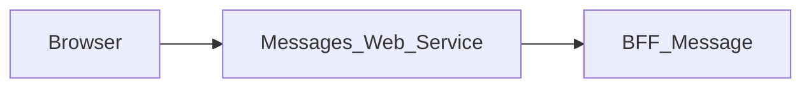

# Messages_Web_Service — Documentation technique

[Présentation du module](module.md) · [English](../en/technical.md) · [README](../../README.md)

## Architecture et traitement des requêtes

Application Next.js 15.5.25, React 19 et TypeScript avec App Router. Le navigateur appelle les routes de la même origine; le serveur Next.js relaie les données vers **BFF_Message**.



La page utilise le client de messagerie pour charger le bootstrap puis les messages et contacts à la demande. Elle transforme les réponses pour le composant partagé `Messaging`. Après le bootstrap, elle relit `/conversations` et le fil actif toutes les dix secondes lorsque l’onglet est visible, ainsi qu’à la reprise du focus. Les réponses arrivées après une sélection ou une mutation sont ignorées pour ne pas écraser l’état récent ; un échec de synchronisation conserve le dernier fil connu et affiche une alerte. La route explicite `/business-references` relaie la réponse de BFF Message.

Le proxy générique lit le contrat OpenAPI versionné pour autoriser chemins et méthodes. Il conserve paramètres de requête, corps binaire, statuts et en-têtes utiles, filtre les en-têtes de transport, désactive le cache et n’effectue pas de suivi automatique des redirections. Son délai est de 15 secondes.

## Données et persistance

Les sources et limites suivantes concernent le BFF associé, dont dépend la sauvegarde des données affichées.

Conversations et messages passent par Message API. Les contacts proviennent directement de la table SQL `users`, y compris l’utilisateur courant (identifiant `sub` du jeton). Les références métier sont agrégées depuis BFF Project et BFF Calendar. La modification locale du profil, les métadonnées de pièces jointes et l’accusé de lecture ne constituent pas une persistance complète.

L’upload de pièces jointes fabrique actuellement des métadonnées et ne fournit pas un stockage binaire durable. Le marquage lu renvoie un compteur nul sans écrire dans Message API ; la page n’appelle donc pas cette route et n’efface pas localement les compteurs de non-lus. Les groupes de conversation passent par l’API, tandis que certaines données de profil restent locales au processus.

L’état React gère l’affichage et les opérations en cours. Ce dépôt ne définit pas de base métier propre; les garanties de sauvegarde sont celles du BFF et de ses sources décrites ci-dessus.

## Installation et lancement local

Utiliser Node.js 22 pour reproduire le job de contrats et npm avec le fichier de verrouillage versionné. Les versions des autres jobs et de Docker sont précisées plus bas.

Les dépendances privées `@mairie360/*` nécessitent un accès GitHub Packages. Configurer `NODE_AUTH_TOKEN` dans l’environnement avec un jeton autorisé à lire ces packages, conformément à `.npmrc`. Ne pas enregistrer la valeur dans Git.

```bash
npm ci
```

Créer `.env.local` à la racine. Exemple pour des BFF exécutés sur la même machine:

```dotenv
BFF_MESSAGE_BASE_URL=http://localhost:4003
```

Démarrer BFF Message, seul BFF du front, puis lancer le web service. Le port `5003` ci-dessous est un choix local explicite pour éviter les collisions; ce n’est pas une affirmation sur les ports de tous les fichiers Compose.

```bash
npm run dev
```

Ouvrir `http://localhost:5003`. Pour exécuter le build avec le script Next.js:

```bash
npm run build
npm run start -- --port 5003
```

## Configuration

Si la session manque ou a expiré, le middleware transmet `redirect` à Login. Il construit la destination avec `MESSAGE_FRONT_URL` lu à l’exécution, puis le chemin et la query demandés, jamais avec l’hôte interne de l’ingress. Sans URL publique valide, Login utilise sa destination Projets par défaut.

Les valeurs ci-dessous sont des exemples locaux ou des comportements explicitement indiqués, pas des identifiants de production.

| Variable ou priorité | Exemple / repli indiqué | Rôle |
| --- | --- | --- |
| `BFF_MESSAGE_BASE_URL` → `MESSAGE_BFF_URL` → `NEXT_PUBLIC_BFF_MESSAGE_BASE_URL` | http://localhost:4003 | Priorité de gauche à droite dans le proxy; l’URL indiquée est le repli local. |
| `COOKIE_DOMAIN` | — | Domaine du cookie `accessToken`, posé par Login et effacé par la déconnexion locale; vérifier sa cohérence avec Login. |
| `ADMINISTRATION_FRONT_URL` | — | Destination de navigation; voir le fichier source qui la lit. Les variables injectées par `next.config.ts` ou préfixées `NEXT_PUBLIC_` sont publiques et prises en compte lors du build. |
| `CALENDAR_FRONT_URL` | — | Destination de navigation; voir le fichier source qui la lit. Les variables injectées par `next.config.ts` ou préfixées `NEXT_PUBLIC_` sont publiques et prises en compte lors du build. |
| `ELEARNING_FRONT_URL` | — | Destination de navigation; voir le fichier source qui la lit. Les variables injectées par `next.config.ts` ou préfixées `NEXT_PUBLIC_` sont publiques et prises en compte lors du build. |
| `EMAIL_FRONT_URL` | — | Destination de navigation; voir le fichier source qui la lit. Les variables injectées par `next.config.ts` ou préfixées `NEXT_PUBLIC_` sont publiques et prises en compte lors du build. |
| `FILES_FRONT_URL` | — | Destination de navigation; voir le fichier source qui la lit. Les variables injectées par `next.config.ts` ou préfixées `NEXT_PUBLIC_` sont publiques et prises en compte lors du build. |
| `LOGIN_FRONT_URL` | — | Destination de navigation; voir le fichier source qui la lit. Les variables injectées par `next.config.ts` ou préfixées `NEXT_PUBLIC_` sont publiques et prises en compte lors du build. |
| `MESSAGE_FRONT_URL` | — | Destination de navigation; voir le fichier source qui la lit. Les variables injectées par `next.config.ts` ou préfixées `NEXT_PUBLIC_` sont publiques et prises en compte lors du build. |
| `PROJECT_FRONT_URL` | — | Destination de navigation; voir le fichier source qui la lit. Les variables injectées par `next.config.ts` ou préfixées `NEXT_PUBLIC_` sont publiques et prises en compte lors du build. |

Dans un conteneur, `localhost` désigne le conteneur lui-même. Utiliser le nom DNS du service BFF sur le réseau Docker, ou une adresse d’hôte accessible. `docker-compose.yml` démarre base, Message API, BFF Message et ce front en mode `next dev` sur le port 5003. Les stacks de sécurité et de performance démarrent la même chaîne à partir des images publiées. BFF Message y est le seul BFF, dans la version du paquet de contrat.

## Routes et contrat de données

Inventaire extrait de `contracts/openapi.json`, reconstruit depuis le paquet publié `@mairie360/bff-message-openapi`. Les paramètres entre accolades sont remplacés par des identifiants réels. La sortie orval ne type que le succès, exposé sous la plage `2XX`; seuls les statuts d’erreur portés par un modèle `<OperationId><statut>` apparaissent. Le tableau ne prétend donc pas lister toutes les erreurs de transport ou de validation.

Ces chemins de données sont exposés à la même origine par le proxy; les pages Next.js sont distinctes. `/openapi.json` et `/swagger.json` sont également relayés. L’interface Swagger `/docs` se consulte directement sur le BFF.

| Méthode | Chemin | Corps déclaré | Statuts déclarés |
| --- | --- | --- | --- |
| POST | `/attachments` | multipart/form-data | 401, 2XX |
| GET | `/business-references` | — | 2XX |
| GET | `/check_apis` | — | 2XX |
| GET | `/contacts` | — | 401, 2XX |
| GET | `/conversations` | — | 401, 2XX |
| DELETE | `/conversations/{conversationId}` | — | 2XX |
| GET | `/conversations/{conversationId}/messages` | — | 401, 2XX |
| POST | `/conversations/{conversationId}/messages` | application/json | 401, 2XX |
| POST | `/conversations/{conversationId}/read` | application/json | 2XX |
| POST | `/direct-messages` | application/json | 401, 2XX |
| POST | `/groups` | application/json | 401, 2XX |
| GET | `/health` | — | 2XX |
| GET | `/me` | — | 401, 2XX |
| PATCH | `/me` | application/json | 400, 2XX |
| GET | `/messaging/bootstrap` | — | 401, 2XX |

### Pages et adaptateurs locaux

| Page | Source |
| --- | --- |
| `/` | [src/app/page.tsx](../../src/app/page.tsx) |
| `/profile` | [src/app/profile/page.tsx](../../src/app/profile/page.tsx) |

| Méthode | Route locale | Source |
| --- | --- | --- |
| GET | `/business-references` | [src/app/business-references/route.ts](../../src/app/business-references/route.ts) |
| POST | `/api/auth/logout` | [src/app/api/auth/logout/route.ts](../../src/app/api/auth/logout/route.ts) |

## Session, permissions et erreurs

BFF Message est le seul BFF du front: la session affichée par le shell vient de `GET /me`, relayé par le proxy. `/api/auth/logout` est une route locale qui efface le cookie `accessToken` (mêmes nom, chemin et `COOKIE_DOMAIN` que Login) sans appel réseau; le rechargement qui suit est redirigé vers Login par le middleware. Le JWT n’est pas révoqué côté serveur, comme avec la déconnexion de BFF User, qui se contentait aussi d’effacer le cookie. Le proxy générique utilise le Bearer explicite ou, en son absence, le cookie `accessToken`. Les permissions métier restent celles du BFF et de ses sources.

Le proxy générique répond 400 pour un chemin invalide, 404 pour un chemin hors contrat, 405 pour une méthode interdite et 502 si le service est injoignable ou dépasse le délai. Les réponses amont sont conservées, y compris les corps vides 204/205/304.

Toutes les réponses portent `X-Frame-Options: DENY`, `X-Content-Type-Options: nosniff`, `Referrer-Policy`, `Permissions-Policy` et `Cross-Origin-Resource-Policy`, `Cross-Origin-Embedder-Policy` et `Cross-Origin-Opener-Policy` (`next.config.ts`), et `X-Powered-By` est désactivé. Pour les requêtes authentifiées, [src/middleware.ts](../../src/middleware.ts) ajoute une `Content-Security-Policy` avec un nonce propre à chaque requête, que Next.js applique à ses scripts. Les pages sont donc rendues à la demande (`dynamic = "force-dynamic"` dans le layout). Les feuilles de style sont limitées à l'origine et au nonce ; seuls les attributs `style` rendus par les composants passent par `style-src-attr 'unsafe-inline'`, et `next dev` autorise aussi `'unsafe-eval'`. Toute nouvelle ressource externe (image, police, API appelée depuis le navigateur) doit être ajoutée à la politique dans `src/lib/content-security-policy.ts`.

## Synchronisation et vérifications

La source du contrat est le paquet publié `@mairie360/bff-message-openapi`, épinglé à une version exacte dans `package.json`. Ne jamais copier le contrat depuis un checkout de **BFF_Message**: le dépôt local peut être en avance sur la dernière version publiée. Après une montée de version:

```bash
npm install --save-exact @mairie360/bff-message-openapi@X.Y.Z   # versions publiées uniquement, jamais 0.0.0-dev/staging
npm run contracts:sync      # reconstruit contracts/openapi.json depuis le paquet installé
npm run contracts:check     # échoue si la version n'est pas exacte, si un second paquet bff-*-openapi existe ou si le snapshot est périmé
npm test
npm run lint
npm run build
```

Ces commandes fonctionnent hors ligne. Reporter aussi la même version sur les images `bff-message` des fichiers `docker-compose*.yml` (`tests/package-contract.test.cjs` le vérifie). `contracts/openapi.json` est la reconstruction versionnée du paquet, lue par le proxy au build et par les tests: ne jamais l'éditer à la main. Les types des routes viennent directement du paquet (`@mairie360/bff-message-openapi/model`); il n'y a plus de `.d.ts` généré. `test:contracts` exécute les tests Node sans couverture; `npm test` les exécute avec des seuils de couverture de 60 % (lignes, branches, fonctions) rapportés sur le TypeScript d'origine.

La sortie orval ne type que les succès, exposés sous la plage `2XX`, plus les statuts d'erreur portés par un modèle `<OperationId><statut>`: toute autre réponse d'erreur simulée dans les tests doit être déclarée `outOfContract: true`.

Les tests `tests/*.contract-mocks.test.cjs` exécutent le vrai client navigateur (`messageClient`, `fetchAuthSession`, `useAuthSession`) à travers les vrais handlers Next.js (catch-all contractuel, `/business-references`, déconnexion locale) jusqu'à un serveur HTTP local simulant BFF Message, piloté par `contracts/openapi.json`. Chaque requête (chemin, méthode, paramètres, corps) et chaque réponse simulée est validée contre ce contrat, et tout appel vers un autre hôte échoue: BFF Message est le seul BFF joignable. Le bloc de proxy rejoue **toutes** les opérations du contrat avec des requêtes et des réponses construites par `contract.sample`, donc une montée de version du paquet couvre automatiquement les nouvelles routes. `tests/network-contract.test.cjs` analyse `src/` pour vérifier que seuls `messageClient`, `auth-session` et `bff-proxy` appellent le réseau, qu'une seule URL de BFF est lue et que chaque chemin appelé par le navigateur correspond à une opération déclarée ou à une route locale sans réseau. `tests/package-contract.test.cjs` vérifie l'épinglage exact du paquet, l'unicité du paquet `bff-*-openapi`, la fraîcheur du snapshot et la version des images `bff-message`. Une nouvelle méthode de `messageClient` fait échouer les tests tant qu'elle n'a pas de scénario contractuel.

Pour une modification uniquement documentaire, vérifier les liens, l’exactitude des deux langues et `git diff --check`; ne pas régénérer les contrats sans modification de leur source.

## CI/CD et exécution Docker

Le job `contracts.yml` utilise Node.js 22, `actions/checkout@v7` et `actions/setup-node@v7`. Il s’exécute sur push, pull request et lancement manuel; il installe avec `npm ci`, contrôle les contrats et lance les tests dédiés.

`cicd.yml` appelle `mairie360/CICD/.github/workflows/frontend-cicd.yml@v2.3.1`, avec `cicd_version: "v2.3.1"` et `node_version: "22"`. Les étapes réutilisables et les environnements GitHub déterminent les contrôles, publications et déploiements effectifs.

Le Dockerfile utilise par défaut `NODE_VERSION=22.15.0` et le build Next.js `standalone`; la commande de l’image est `["node", "server.js"]`. Le port de l’image et les mappings Compose peuvent différer du port local proposé plus haut.

Avant un lancement Docker, vérifier les variables de service, les secrets de build et les réseaux dans les fichiers du dépôt. Une CI verte valide ses jobs; elle ne prouve pas la disponibilité des services métier dans un environnement distant.

## Diagnostic

Diagnostic du BFF associé: Si les conversations fonctionnent mais pas les contacts, vérifier PostgreSQL. Si seules les références métier manquent, vérifier les BFF sources de BFF Message et les permissions de la session. `/me` fournit le profil affiché par le shell du front.

En cas d’erreur de proxy, comparer la route et la méthode à l’inventaire, vérifier l’URL du BFF puis la session. Pour un 401 après navigation entre modules, vérifier le cookie `accessToken`, son domaine et la session émise par Login. Un 404 sur un besoin décrit dans `BACKEND.md` peut correspondre à une fonctionnalité seulement proposée.

## Repères dans le dépôt

- [src/app/page.tsx](../../src/app/page.tsx)
- [src/app/business-references/route.ts](../../src/app/business-references/route.ts)
- [src/app/_components/app-shell.tsx](../../src/app/_components/app-shell.tsx)
- [src/middleware.ts](../../src/middleware.ts)
- [src/lib/bff-proxy.ts](../../src/lib/bff-proxy.ts)
- [src/app/[...path]/route.ts](../../src/app/%5B...path%5D/route.ts)
- [src/app/api/auth/logout/route.ts](../../src/app/api/auth/logout/route.ts)
- [src/lib/auth-session.ts](../../src/lib/auth-session.ts)
- [contracts/openapi.json](../../contracts/openapi.json)
- [scripts/contracts.mjs](../../scripts/contracts.mjs)
- [scripts/orval-contract.mjs](../../scripts/orval-contract.mjs)
- [package.json](../../package.json)
- [.github/workflows/contracts.yml](../../.github/workflows/contracts.yml)
- [.github/workflows/cicd.yml](../../.github/workflows/cicd.yml)
- [Dockerfile](../../Dockerfile)
- [docker-compose.yml](../../docker-compose.yml)

Compléments historiques: [BFF.md](../../BFF.md), [BACKEND.md](../../BACKEND.md). Les besoins proposés doivent rester distincts du comportement effectivement implémenté.
